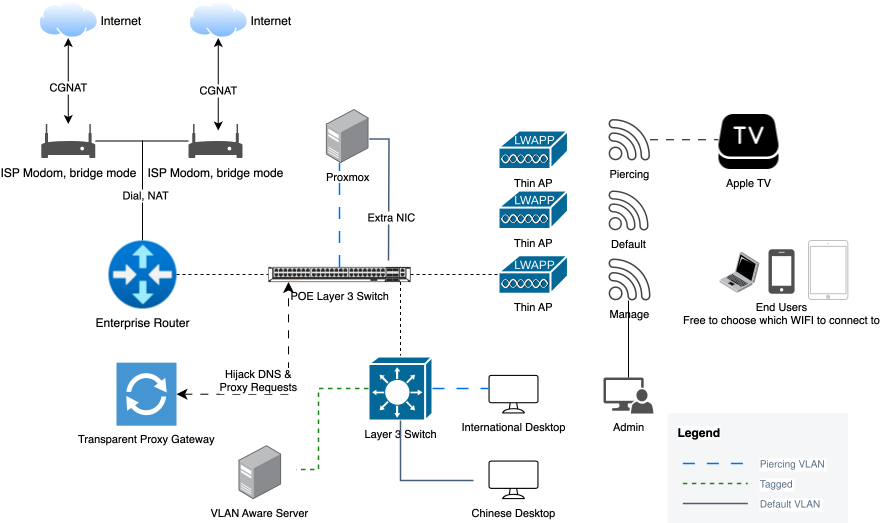
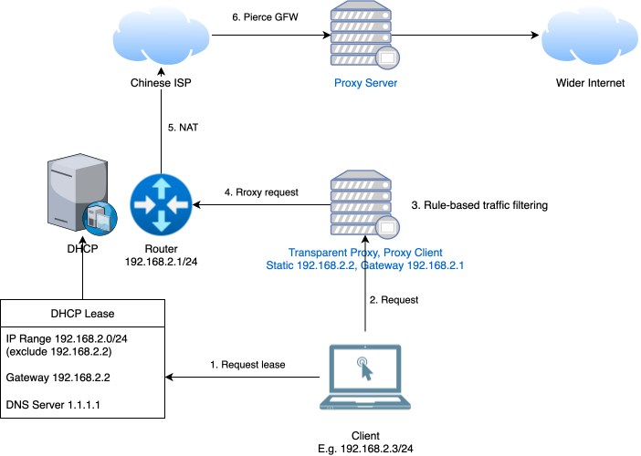
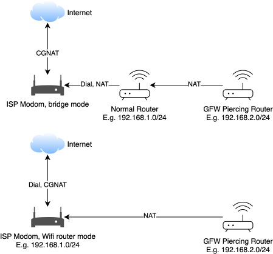

import { Color } from '@site/src/components/Color';
import PhicommN1 from "./phicomm-n1.jpg"
import BestVpnServices from "./best-vpn-services.png"
import Commitment from "./Commitment.jpg"

Watch me build the best suiting solution for Chinese networking environment as a software engineer.

{/* truncate */}

## 1 The Problem

The main issue with setting up a homelab in China is that the [GFW](https://en.wikipedia.org/wiki/Great_Firewall) stands in the way between me and the rest of the world, where great resources are available.

## 2 The Goals

Since I'm an enthusiast and a software engineer, a good homelab environment to me should satisfy the following attributes (unranked).

1. Transparent when using.
2. Reliable.
3. Environmentally ~financially~ friendly.
4. Can switch between default and GFW-piercing mode easily.
5. Strong signals in practically every room.

:::note
This is a home, where living is also part of the equation. I need to consider my families and local app usage such as Taobao, JD, BiliBili, etc.
:::

## 3 The Progressing Solutions

Here I'll give a quick introduction to the solutions I used before, they are awesome in their own rights, but did not best suit my growing demand. Go to [section 4](#silver-bullet) if you just want to learn my current setup.

## 3.1 VPN

VPN providers provide one-click solutions that most people are familiar with. They are first invented to connect to networks behind firewall or NAT, like coporate networks. But the protocols for transmitting data are not intended for GFW piercing. So they may not work best in the context of Chinese network environment.

### Pros and Cons

- ✅ Easy to setup.
- ✅ Traffic is usually unlimited.
- ❌ Can get expensive.
- ❌ Cannot install on all devices.
- ❌ Speed is limited.
- ❌ Toggle on/off before use is inconvenient.

### Some VPN Serives

## 3.2 Per-device Proxy

These proxies refer to the one-click solutions you download from app stores, and they normally connect to their proprietary servers out-of-the-box. The protocols they use are more suited to the Chinese network environment than VPNs, in that they are designed to bypass censorship, and some will do some simple traffic splitting and thus be a little faster.

### Pros and Cons

- ✅ Easy to setup.
- ✅ Free ones are available.
- ✅ Traffic is usually unlimited.
- ❌ Cannot install on all devices.
- ❌ No control over the information it use.
- ❌ Speed is limited.
- ❌ Toggle on/off before use is inconvenient.

:::note
I deliberately discern VPN and per-device proxy from one another, based on the protocols they use. To not-so-tech-savvy end users, it's almost negligible.
:::

:::tip
These are the "sketchy" ones that come up with searches using keyword "翻墙" or "代理" in app store.
:::

## 3.3 Proxy Manager

This is a separate-style proxy where you have to find the proxy server providers yourself, and they usually go by the name airports. Then you purchase the services from them and load the server configurations into one of the supported clients. The go-to app for airports are Clash, ShadowRocket, [sing-box](https://github.com/SagerNet/sing-box) (my favorite), Stash, etc.

### Pros and Cons

- ✅ Speed is good.
- ✅ Cheaper ones are available.
- 🟡 Hurdles for even the simple use case.
- 🟡 Traffic is limited.
- 🟡 Limited control over the information it use.
- ❌ Cannot install on all devices.
- ❌ Toggle on/off before use is inconvenient.

## 3.4 Proxy Manager on Routers/Gateways {#proxy-on-routers}

To kick it up a notch, you can install the proxy manager on supported routers, like  home WIFI routers with custom [OpenWRT](https://openwrt.org/) firmware. That way, all your connected devices will transparently have the capability of piercing GFW.

### Pros and Cons

- ✅ Speed is good.
- ✅ Cheaper ones are available.
- ✅ Pierce GFW for all connected devices.
- 🟡 Traffic is limited.
- 🟡 Limited control over the information it use, though using the firmware you can configure with more granularity.
- ❌ Much trouble for even the simple use case,
- ❌ Chinese app usage is slower.

:::tip
I find pre-flashed WIFI routers will save software engineers a lot of hassle.
:::

## 4 The Silver Bullet ❓ {#silver-bullet}

:::warning[I'm not afraid of troubles]
:::

If you're like me, you most definitely will enjoy the beauty of this solution. At least for now, I think I'm done for a good while before the next big architectural change.

The problem with going full throttle with [proxy on routers](#proxy-on-routers) is that you have to do that for every single home WIFI router. If you've got a big house, or just have concrete walls, the signal attenuation is no joke, and I live in a two-storey condo with a lot of them. So this solution does not scale well with me.

To make matters worse, the network cables are threaded into the tubes buried into the hard concrete walls. After years of use, it's practically impossible to pull them out. And in no way should I go with the consumer WIFI mesh technology since I would still not be able to switch quickly between default and GFW-piercing mode for routing without running two separate WIFI routers in each location!

### Topology

Let's appreciate this ginormous beast before I explain the rationale.

### VLAN Is Our Savior

Luckily, let's turn our attention to enthusiast/enterprise-grade products. There is this tested technology [VLAN](https://www.practicalnetworking.net/stand-alone/vlans/) that comes to rescue. Essentially, if you want to carry two LANs in one physical cable, VLAN is the way to go. It tags packets that are understood by the link layer (OSI level 2) switches, so it's totally transparent to the network layer. 

### Access Points

With a layer 3 (VLAN-aware) switch, we can let our network cables carry default and GFW-piercing networks simultaneously, by setting port as trunk port. At each end of such ports is a WIFI access point to emit both WIFI signals bridged to either network, i.e. two WIFI names in each emitter.

#### Supported Routers

Most WIFI access points have to be controlled by a controller software running on the network, and usually it's baked in the router. So maintaining a consistent brand of network gears is always the right move.

### Transparent Proxy Gateway - TPG 🌟

This is a device on the GFW-piercing network/VLAN to proxy our requests, and its static IP address and gateway are essential (not using DHCP). For this particular VLAN, you need to configure the DHCP to set gateway as the address of this TPG, and a DNS server outside of the local network, to allow DNS request to be correctly hijacked.

As for the TPG itself, you should turn on packet forwarding for the connected NIC, and hijack DNS requests, do traffic splitting and routing based on rules/rulesets, and finally use a GFW-piercing [protocol](https://sing-box.sagernet.org/configuration/outbound/) to communicate with the proxy server on the Internet. This looks like a mouthful, but all of this can be achieved using [sing-box](https://vpnrouter.homes/singbox/) and a single configuration file!

This is an example setup for this particular VLAN.

### Current Setup

Now you have a good understanding of all the considerations into building a robust homelab environment, take a look at my commitment before doing all this yourself!

## 5 Ending

The silver bullet is my take on setting up a homelab, it may or may not be your cup of tea. With that being said, I have some experience of building similar small-scale solutions that have almost-identical functionalities, but with conditions applied.

### 5.1 Hope is Not Lost

Consumer WIFI routers normally only have one bridged WIFI network, and no VLAN support, but that does not mean you cannot go with [proxy on routers](#proxy-on-routers). In fact, if you only have a small apartment in China, I would highly recommend this by plugging a GFW-piercing WIFI router behind the NAT of a normal WIFI router, and use DHCP for the WLAN side of the GFW-piercing WIFI router, namely a double-NAT. That way, you get almost the same benefits of my silver bullet setup and tremedouusly less trouble!

I had set up such a system for a friend of mine in his apartment. And the additional cost is less than $20 for the pre-flashed WIFI router.

#### Network Topology

These two almost-equivalent setups differ in where the dialing happens, with the latter saving you another router to your budget!

### 5.2 Bonus

I had the privilege to install a [Ubiquiti](https://ui.com/) solution for one of my friends, and she wants to go with the lowest budget as possible, whilst still having all the benefits of my silver bullet setup. She particularly liked the UI of the Ubiquiti gear, but she was not expecting to throw a couple hundred dollars into the project. It turned out that if you had one of the access points, you can host your own controller on a third-party machine, no need for a gateway from Ubiquiti! I used the awesome [script](https://community.ui.com/questions/UniFi-Installation-Scripts-or-UniFi-Easy-Update-Script-or-UniFi-Lets-Encrypt-or-UniFi-Easy-Encrypt-/ccbc7530-dd61-40a7-82ec-22b17f027776) to set up the controller successfully, and enjoyed the beautiful UI.