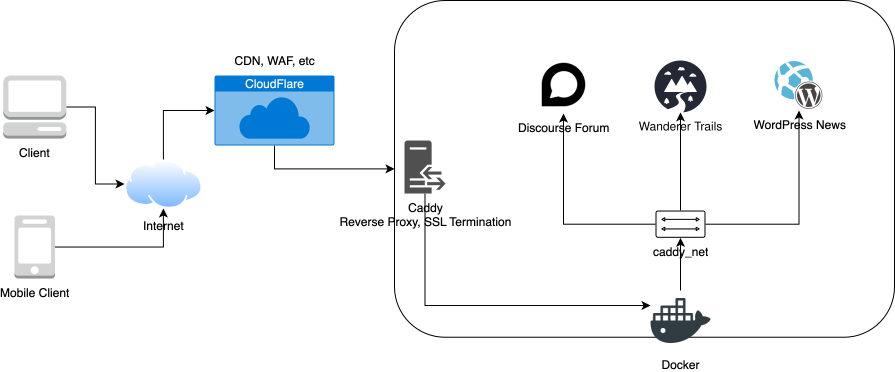

import Tabs from '@theme/Tabs';
import TabItem from '@theme/TabItem';
import { Color } from '@site/src/components/Color';

I'm no front end developer, but I host [dirtbikechina.com](https://www.dirtbikechina.com).

{/* truncate */}

## 1 Introduction

**dirtbikechina.com™** is a project that aims to build the <span style={{color:'#33c1ff'}}>largest</span> online community for dirt bike lovers based in China. In this post, I'll attempt to document the process and technical effort towards this goal. For anecdotal stories, refer to this [post](https://calvin.dirtbikechina.com/lifestyle/dirtbikechina-anecdotes).

## 2 Tech Stacks

Using OSS applications including

1. [Discourse](https://www.discourse.org/) for the main online forum.
2. [Wanderer](https://wanderer.to/) for trail recording and sharing support.
3. [WordPress](https://wordpress.org/) for long-form articles.
4. [Logto](https://logto.io/) for authentication and authorization.
5. [Caddy](https://caddyserver.com/) for reverse proxy, SSL termination, etc.
6. [Docker](https://www.docker.com/) to nicely wrap it all up.

we can self-host the project on a single Linux server.

### 2.1 Architectural Overview



### 2.2 URLs

1. [Newsletter](https://www.dirtbikechina.com/), only authorized writers.
2. [Forum](https://forum.dirtbikechina.com/), every trusted meenber is able to talk.
3. [Trail management](https://trails.dirtbikechina.com/), integrate with iOS/Andriod app to record, edit, share trails.
4. [Authentication](https://auth.dirtbikechina.com/), single-sign-on and user management.
5. [CDN](https://cdn.dirtbikecn.com/), speedup for Chinese user.

## 3 Prerequisites

### 3.1 Domain

Buy a domain from a registrar. You'll need to configure DNS resolution settings from your registrar in later steps.

> Domains cannot be transferred to a new registrar within 60 days of purchase, according to [ICANN](https://www.icann.org/resources/pages/name-holder-faqs-2017-10-10-en).

### 3.2 Email Server

We need an email service provider capable of transactional emails, because email service providers like Gmail, Yahoo aren't suitable. The basic workflow with each provider roughly looks like

1. Add the domain to your provider.
2. Verify the domain.
    - The provider will generate DKIM and DMARC TXT and MX records.
    - Fill them into your domain registrar.
    - Verify on the provider website.
3. Generate SMTP information.
4. After the website (WordPress in this case) is online and compliant, request a manual review to approve the account.

:::note
Some provider will be more strict on the compliance side.
:::

#### 3.2.1 Examples

Here are a couple to choose from.

<Tabs className="email-service-providers">
  <TabItem value="Brevo">
[Brevo](https://www.brevo.com/) is recommended by Discourse, and supports email templates, has transactional SMS, free for small usage (300 per day).

1. Strict on compliance.
2. Has good interface and documentation.
3. Before manual appproval, account is in restricted cannot send emails.
  </TabItem>

  <TabItem value="AWS SES">
[SES](https://aws.amazon.com/ses/) is powerful, cheap, good quality of service.

Note that:

1. When copying MX record for `email` prefix, strip the priority value from the given value, refer to [here](https://community.cloudflare.com/t/error-9009-while-entering-mx-record-for-aws-ses/196063/2).
2. Before manual appproval, account is in sandbox mode and cannot send emails except to verified emails or domains.
  </TabItem>

  <TabItem value="WeCom">
Haven't looked into [WeCom](https://work.weixin.qq.com/) yet, but said to be friendly to Chinese developers.
  </TabItem>
</Tabs>

---

### 3.3 Server

For development and initial stage, I'll be using a single server.

1. Rent a relatively powerful instance.
2. Install Docker following the official [guide](https://docs.docker.com/engine/install/ubuntu/).

<Tabs className="cloud-providers">
  <TabItem value="AWS">
Our good ol' friend AWS once again asks for money.
  </TabItem>

  <TabItem value="Digital Ocean">
The [Droplet](https://www.digitalocean.com/pricing/droplets) is your true friend!
  </TabItem>

  <TabItem value="Hetzner">
[Hetzner Cloud](https://www.hetzner.com/cloud/) is even cheaper.
  </TabItem>
</Tabs>

---

## 4 Technical Details

### 4.1 Docker Preparation

Before start, fill in necessary environment variables into `.env`.

1. Create a bridge network `sudo docker network create caddy_net`.
2. Create a `docker-compose.yml` file that incorporates all the running services, check the final outcome at [GitHub](https://github.com/monkeyboiii/dirtbikechina/blob/main/docker-compose.yml).
3. `sudo docker compose up -d`.

### 4.2 WordPress

#### 4.2.1 Install

Bundled in the `docker-compose.yml` file.

After the container is running in docker, update the `site_url` and home entry in DB using the `mysql` client inside mysql container

```shell
export $(grep -v '^\s*#' .env | xargs)

# update
docker exec -it mysql mysql \
	-u"$MYSQL_USER" \
	-p"$MYSQL_PASSWORD" "$MYSQL_DATABASE" \
	-e "UPDATE wp_options SET option_value = 'https://www.dirtbikechina.com' WHERE option_name IN ('siteurl','home');"

# confirm
docker exec -it mysql mysql \
	-u"$MYSQL_USER" \
	-p"$MYSQL_PASSWORD" "$MYSQL_DATABASE" \
  	-e "SELECT option_name, option_value FROM wp_options WHERE option_name IN ('siteurl','home');"
```

#### 4.2.1 Customization

1. Use [News Magazine X](https://wp-royal-themes.com/themes/item-news-magazine-x-free/#!/demo-preview) theme.
2. Privacy page using either built-in support or third-party plugin to auto-generate.
3. Brevo subscription form inside NMX subscription form block.
4. WP-SSO plugin.

### 4.3 Discourse 🌟

#### 4.3.1 Install

1. Follow step 6 in discourse [installation guide](https://github.com/discourse/discourse/blob/main/docs/INSTALL-cloud.md#6-install-discourse).
2. Create a symbolic link from this repo to that location, i.e. `ln -s /var/discourse discourse`, for convenience.
3. Copy the `app.yml` file under `discourse/containers/`, or better, hard link to that location and `chown`.
    - Optionally, revoke RW access other than `root` for `app.yml`.
4. Fill in necessary environment variables to `app.yml`, notes in GitHub [sample.env](https://github.com/monkeyboiii/dirtbikechina/blob/main/sample.env).
5. Run a series of command to build the containers.

```shell
# as root
su -s

cd /var/discourse

./launcher rebuild app
```

#### 4.4.2 Configuration

| Status | Item                                                                                        | Purpose            | Comment   |
|--------|---------------------------------------------------------------------------------------------|--------------------|-----------|
| 🟢 | [FBK Pro Theme](https://meta.discourse.org/t/fkb-pro-social-theme/234323)                       | Facebook-like UI   |           |
| 🟢 | [Google OAuth 2.0](https://meta.discourse.org/t/configure-google-login-for-discourse/15858)     | Login via Google   |           |
| 🟡 | [Apple OAuth 2.0](https://meta.discourse.org/t/discourse-apple-authentication/171485)           | Login via Apple    |           |
| 🟡 | [SMTP Testing](https://app.brevo.com/)                                                          | Register via Email | Must-have |
| 🟢 | [DiscourseConnect](https://meta.discourse.org/t/configure-single-sign-on-sso-with-wp-discourse-and-discourseconnect/223494#logging-in-to-wordpress-with-discourse-discourseconnect-client-9) provider | SSO provider |
| 🟢 | WP-Discourse [install](https://wordpress.org/plugins/wp-discourse/)                             | Comment management | Easy      |
| 🔴 | Wanderer custom SSO through Oauth 2.0                                                           | SSO client         | Need investigation with existing discourse provider option |
| 🟣 | Badge System                                                                                    | Customization      | Outsource |
| 🟣 | Logo System                                                                                     | Customization      | Outsource |
| 🔘 | Category                                                                                        | Customization      | Outsource |
| 🔘 | Tag                                                                                             | Customization      | Outsource |
| 🔘 | Menu Item                                                                                       | Customization      | Outsource, not priority |

#### 4.4.3 Tweakings

I'm currently looking at `Allow username in share links` !!!

### 4.4 Wanderer 🌟

#### 4.4.1 Install

Using the merged `compose.yml` file adapted from this [doc](https://wanderer.to/run/installation/#docker-compose-overview).

Create a superuser in container like [here](https://pocketbase.io/docs/going-to-production/#deployment-strategies).

#### 4.4.2 Customization

- [ ] Login via discourse (recommended)
- [ ] Embed iframe in discourse

### 4.5 Logto

#### 4.5.1 Install


### 4.6 Caddy Configuration

Refer to `Caddyfile`.
